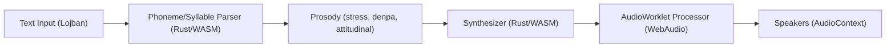

# Executive Summary  
A Lojban TTS in Rust/WASM must rigorously enforce Lojban phonology: vowels (a e i o u plus schwa *y*), *x*=[x], *c*=[ʃ], *j*=[ʒ], period *.* = glottal stop/pause, etc.  Every content word (brivla) is stressed on the penultimate counted syllable (ignoring *y* and syllabics).  Denpa (“.”) inserts a pause (short silence + glottal stop) to separate clauses, preventing stress clashes.  Attitudinal particles (e.g. `.ui`, `.oi`) should modulate pitch contours: e.g. rising/F0 raise for positive, falling for negative attitudes.  

We compare four synthesis approaches:

- **Concatenative** (diphone/phoneme splicing) – uses recordings. *Quality:* high naturalness (human recordings). *Size:* large corpus. *CPU:* moderate (buffer handling). *Latency:* high (loading buffers). *Complexity:* high (unit database, boundary smoothing). *Data:* requires large Lojban speech corpus (not allowed here).  
- **Formant (Klatt-style)** – parametric rules. *Quality:* robotic/low, intelligible. *Size:* very small (code-only). *CPU:* low–moderate (simple filters). *Latency:* low. *Complexity:* moderate (design formant filter). *Data:* none (rule-based).  
- **Parametric/LPC** – source-filter with linear prediction. *Quality:* moderately natural (breathy/robotic). *Size:* small. *CPU:* moderate–high (filtering per sample). *Latency:* low. *Complexity:* moderate (code linear predictor, residual). *Data:* none or minimal calibration data.  
- **Neural Vocoder (e.g. LPCNet, WaveRNN)** – train on generic data. *Quality:* high (more natural). *Size:* large (model weights). *CPU:* high (GFLOPS-scale inference). *Latency:* higher (buffered processing). *Complexity:* high (ML model integration). *Data:* no Lojban needed if using multi-lingual/pretrained model; but still heavy compute.  

The favored approach for “robotic” voice is **formant or LPC**: they require no Lojban speech data, yield predictable output, and run easily in-browser. If quality needs lifting, a lightweight neural vocoder (e.g. LPCNet) might be considered with **transfer learning** (using non-Lojban data for acoustic modeling) at the cost of heavier CPU usage. Concatenative is impractical here (no Lojban corpus available) and large.

We propose a Rust/WASM pipeline: Rust code (compiled via `wasm-bindgen`/`wasm-pack`) takes text → phoneme/syllable sequence → prosody tags → waveform samples. The WebAudio integration can use either **AudioWorklet** (best low-latency processing) or pre-generated buffers via **AudioBufferSourceNode**, with a **ScriptProcessorNode** fallback (deprecated). WASM memory is accessed via `WebAssembly.Memory` (ArrayBuffer view). Data crossing JS/WASM can use raw Float32 arrays or structured messages over `MessagePort`. We show pseudocode for each step below and code snippets illustrating the architecture.  A Mermaid diagram outlines the system components.  Recommendations for pitch (F₀) contours and durations for a mechanical voice are given (e.g. flat base F₀ ~100–120 Hz, small envelopes, ±20–30 Hz attitudinal shifts). Rust crates (e.g. `wasm-bindgen`, `web-sys`, `klatt`/`klattsch`, `hound`) and JS APIs (Web Audio) are cited. 

## Lojban Phonology & Prosody  
Lojban spelling is phonetic. Key mappings:  
- Vowels **a,e,i,o,u** as [a e i o u]; **y** = [ə] (schwa).  Diphthongs (`ai, ei, oi, au, etc.`) form single syllables.  
- Consonants: *c*=[ʃ], *j*=[ʒ], *x*=[x], *z*=[z], *s*=[s], *k*=[k], *g*=[g], *r* ~ [r], *l,m,n* may be syllabic [l̩, m̩, n̩] (treated as vowels in stress rules).  
- Special symbols: **‘** = [h] glottal fricative, *.* = [ʔ] glottal stop (optional to mark word breaks). A comma `,` is a syllable boundary in names.  
- **Syllabification:** Each vowel (or diphthong) is the nucleus of one syllable.  Rules for consonant clusters: a single consonant goes with the following vowel; two consonants normally split (first with previous syllable, second with next), except if the two form a valid *initial* pair (like `kl, pr, ml, etc.`) then both go to the next syllable. For three consonants, split after the first. Apostrophes and commas explicitly break syllables.  
- **Stress:** Content words (brivla, lujvo) have primary stress on the next-to-last counted syllable.  “Counted” syllables exclude any whose nucleus is *y* or a syllabic consonant, and buffer vowels (inserted [ɪ] for clusters) also are not counted.  Examples: `pujenaicajeba` → pu,je,nai,ca,je,ba, stress on “nai”. Structural words (cmavo) can vary, but by default are unstressed. To avoid ambiguity, a *denpa* (`.`) can force a pause between a stressed cmavo and a following brivla.  
- **Denpa bu (`.`):** Represents a glottal stop/pause. In speech, insert a short silence (e.g. 50–150 ms) plus [ʔ] at `.`, resetting stress/prosody as if a word break.  
- **Attitudinals:** These modify intonation of the preceding clause. In general prosody research, falling-F₀, low pitch correlate with negative or unfriendly attitude, while rising-F₀, higher pitch correlate with friendliness or positive attitude.  We therefore map different attitudinals to simple pitch curves (see below). For example, `.ui` (happiness) might use a slight rise at end, `.oi` (complaint) a falling pitch.  

## Synthesis Approaches (Trade-offs)  
| **Approach**         | **Quality**       | **Size**              | **CPU**         | **Latency**   | **Complexity**           | **Data Needs**         |
|----------------------|-------------------|-----------------------|-----------------|---------------|--------------------------|------------------------|
| Concatenative (diphone) | **High** (natural) | Large (voice DB)   | Moderate        | High (fetch & stitch) | High (unit inventory, smoothing) | High (recorded Lojban corpus) |
| Formant (Klatt)      | Low–Moderate      | Very small (code)     | Low–Med         | Low           | Medium (design filters)  | None (rules only)      |
| Parametric (LPC)     | Moderate (synthetic) | Small–Med (coeff)    | Moderate–High   | Low           | Medium (source-filter + coeff) | None (could use general speech to tune) |
| Neural Vocoder (LPCNet, WaveRNN) | **High** (natural) | Large (model weights) | High (≈GFLOPS) | Medium–High | High (model integration) | Medium (pretrained on other lang., no Lojban needed) |

- **Concatenative:** Stitching recorded phonemes/diphones yields very natural speech, but requires a large Lojban speech database (not available here). It also has high memory (audio snippets) and implementation complexity (unit selection, boundary smoothing).  
- **Formant (rule-based):** Models vowel formants and consonant transitions (Klatt synthesis). It needs no training data and runs cheaply, but sounds robotic. Examples: old synthesizers, eSpeak. Code size is small (just filters and noise + pulse).  
- **Parametric (LPC/vocoder):** Uses linear prediction for spectral envelope and an excitation signal (pulse/noise). The “robotic” *LPCNet* combines LPC with an RNN; pure LPC vocoder is simpler. It requires no Lojban audio but moderate CPU to run filters. Quality is better than naive formant but still synthetic.  
- **Neural Vocoder:** Modern TTS (WaveNet, WaveRNN, BigVGAN) yields high quality but typically huge models. “Lightweight” variants like LPCNet achieve good quality at a few GFLOPS. On WASM, a small neural model might run if carefully optimized (or via WebAssembly SIMD), but latency and CPU may be limiting. However, since we disallow Lojban-specific training data, a pretrained universal model could be used (e.g. a multilingual WaveRNN), incurring no new data cost.  

**Recommendation:** For a mechanical Lojban voice, a formant or LPC approach is pragmatic: it produces intelligible speech with minimal resources and no need for Lojban recordings. We can then adjust pitch and duration algorithmically (see below) to sound robotic. A neural vocoder (e.g. LPCNet) could optionally be layered for waveform refinement if CPU allows, using a model trained on English or multi-language data, but this greatly increases complexity and binary size. The table above captures these trade-offs.

## Rust/WASM Implementation Details  
- **Toolchain:** Use `rustup target add wasm32-unknown-unknown`, and build with `cargo +nightly build --target wasm32-unknown-unknown` (or use [wasm-pack] with `wasm32-unknown-unknown` target). Bindings via [`wasm-bindgen`] generate JS glue. `wasm-pack` can package the module for NPM and generate TypeScript definitions. The output `.wasm` is typically tens to a few hundred KB (plus JS glue).  
- **Memory:** WebAssembly memory is a resizable ArrayBuffer. By default, WASM uses 64 KiB pages; the maximum addressable memory with 32-bit addressing is 2^16 pages ≈ 4 GiB (practical limits are lower). For audio synthesis, only a few MB may be needed (e.g. a few seconds of Float32 samples at 48kHz is ~1 MB per channel). Large models (neural vocoder weights) also reside in this memory. Avoid using >100 MB to keep load times reasonable.  
- **CPU/Performance:** WASM executes at near-native speed. For real-time audio, we must produce ~44,100 samples/s per channel. In an AudioWorklet (128-sample frames at 48 kHz ≈ 375 callback/s), each callback has ~2.7 ms wall-clock to compute. Formant/LPC filters and state-machine code can easily keep up. A neural model may need optimization (quantization, SIMD). Test performance on target browsers. (Note: with Multithreading or SIMD, speed may improve, but we assume only basic WASM features.)  
- **Audio Buffer Format:** Use IEEE-754 Float32 PCM. Web Audio works with `Float32Array`. In Rust, generate samples in a `Vec<f32>` or `[f32]` slice. Pass to JS either by returning a JS `Float32Array` via `wasm-bindgen`, or by writing into a shared `WebAssembly.Memory` buffer that JS wraps as `Float32Array`. If streaming (AudioWorklet), have Rust fill a pre-allocated shared buffer each callback.  
- **Latency:** For AudioBufferSourceNode, no continuous latency – the buffer is played as-is. For streaming (Worklet), the latency is the scheduling quantum (128 samples ≈ 2.7ms). ScriptProcessor’s latency depends on bufferSize (256–16384 samples); smaller means lower latency but more CPU overhead (we’ll default to the Worklet’s 128).  
- **JS/WebAudio Integration:**  
  - *AudioBufferSourceNode:* Generate the entire utterance in WASM first (or on-the-fly chunks), then create an `AudioBuffer` (e.g. `audioContext.createBuffer(1, length, sampleRate)`) and copy data (`buffer.getChannelData(0).set(wasmSamples)`). Then start playback. Simple but not low-latency streaming.  
  - *AudioWorklet:* Preferred for interactive/streaming. In JS, `await audioCtx.audioWorklet.addModule('synth-worklet.js')`. That script registers an `AudioWorkletProcessor` that on each `process()` call asks WASM for the next 128 samples. See example code below. The Worklet runs on the Audio thread for low latency.  
  - *ScriptProcessorNode:* Deprecated legacy fallback. If Worklet is unavailable, you could use `audioCtx.createScriptProcessor(bufferSize)` and its `onaudioprocess` event to invoke WASM. It has higher latency and is discouraged, but can be supported as fallback.  

- **API Design (JS↔WASM):** Expose Rust functions via `#[wasm_bindgen]` for key operations. For example:  
  ```rust
  #[wasm_bindgen]
  pub fn synthesize_lo(text: &str) -> Vec<f32> { /* return audio samples */ }
  #[wasm_bindgen]
  pub fn synthesize_chunk(buffer_ptr: *mut f32, len: usize) { /* fill buffer */ }
  ```  
  Or export a `struct Synthesizer` with methods (`compile`, `generate`). Communicate text (UTF-8 JS string→Rust `&str`) and control parameters via these calls.  For streaming, one can also use `MessagePort` (WorkletNode.port) to send commands (e.g. phoneme schedule) to the Worklet, as in the klattsch example. Data serialization (e.g. phoneme lists) can be done by simply sending JSON messages or numeric codes via `postMessage`.  

- **Threading / Shared Memory:** WebAssembly threads (shared memory) are possible on modern browsers but require `SharedArrayBuffer` and explicit compilation flags. For now assume single-threaded, with WebAudio’s audio thread cooperating with the main thread. We avoid complex threading given the scope.  

- **Summary:** Use `wasm-bindgen` (Rust crate) and possibly [`web-sys`] (for WebAudio types). Package with `wasm-pack` for distribution. Keep the module self-contained. In JS, use WebAudio APIs directly (no external lib needed, though frameworks like Tone.js could simplify some scheduling).  

## Approach Comparison Table  

| Feature           | **Concatenative**        | **Formant Klatt**    | **Parametric (LPC)**  | **Neural Vocoder**    |
|-------------------|--------------------------|----------------------|----------------------|-----------------------|
| **Quality**       | **High naturalness** (human recordings) | Low–Robotic | Moderate (some naturalness) | **High** (if trained) |
| **Binary Size**   | Large (audio corpus, big WASM)  | Very small (code)  | Small–Med (filters+coeffs) | Large (NN weights)    |
| **CPU Load**      | Moderate (buffer ops)  | Low (simple DSP)   | Medium (filters)    | High (GFLOPS‑scale) |
| **Latency**       | High (load/concatenate) | Low (on-the-fly)   | Low                 | Medium–High           |
| **Complexity**    | **High** (unit DB, smoothing) | Medium (implement synth) | Medium (predict/filter) | **High** (NN inference) |
| **Data Needs**    | **Extensive** (Lojban recordings) | None | None (optional training on generic data) | Medium (pretrained model, no Lojban required) |

*Citations:* The trade-offs mirror classic TTS analysis.  Concatenative excels in quality but is impractical without Lojban corpus.  Formant/LPC methods have tiny footprints and no data need, fitting the no-cloud requirement.  Neural vocoders achieve best naturalness but at large compute and size cost (e.g. LPCNet ~3 GFLOPS). 

## Phoneme Mapping & Syllabification Pseudocode  

```pseudo
# Phoneme mapping (grapheme → phoneme)
phoneme_map = {
  "a":"a", "e":"e", "i":"i", "o":"o", "u":"u", "y":"ə",  # vowels
  "b":"b", "c":"ʃ", "d":"d", "f":"f", "g":"g", "j":"ʒ",
  "k":"k", "l":"l", "m":"m", "n":"n", "p":"p", "r":"r",
  "s":"s", "t":"t", "v":"v", "x":"x", "z":"z",
  "'":"h",  # glottal fricative
  ".":"ʔ"   # glottal stop (pause)
}
function letters_to_phonemes(text):
  # Normalize to lowercase
  text = text.lowercase()
  # Split on whitespace and punctuation except '.' which we keep as symbol
  tokens = split(text, include_delims)
  phonemes = []
  for each token in tokens:
    if token == ".": 
      phonemes.append("PAUSE")  # marker for denpa
    else:
      for letter in token:
        if letter in phoneme_map:
          phonemes.append( phoneme_map[letter] )
        # ignore apostrophe (lormepre) or handle elsewhere
  return phonemes

# Syllabification (on phoneme list)
function syllabify(phonemes):
  syllables = []
  current = []
  vowels = ["a","e","i","o","u","ə"]  # include schwa 'ə'
  for each ph in phonemes:
    if ph == "PAUSE":
      # end current syllable, mark pause
      if current != []: syllables.append(current)
      syllables.append(["PAUSE"])
      current = []
    else if ph in consonants:
      # peek next to decide clustering
      # (We'll assign later when vowel arrives)
      current.append(ph)
    else if ph in vowels:
      # found a vowel or diphthong nucleus
      current.append(ph)
      # now break syllable: handle clusters preceding and following:
      #   If previous consonant(s) exist, assign by Lojban rules:
      #     - If current has >1 consonant at start and first two form valid initial pair,
      #       keep both with this vowel; else split first with previous syllable.
      # Implementation detail depends on storing pending cons.
      syllables.append(current)
      current = []
    # (Handle diphthongs by grouping vowels, omitted for brevity)
  if current != []: syllables.append(current)
  return syllables
```

Note: Lojban rules: *“A single consonant always belongs to the following vowel. A consonant pair is normally split between syllables unless it’s an allowed initial cluster, in which case both go with next vowel.”* We implement this by examining pending consonants whenever a vowel arrives.

## Stress Assignment and Denpa Pauses  

```pseudo
# Stress assignment (penultimate rule)
function assign_stress(syllables):
  # Filter out syllables with schwa or syllabic cons
  counted = []
  for syl in syllables:
    if syl == ["PAUSE"]: continue  # skip pauses
    nucleus = any(sym in vowels for sym in syl)
    if nucleus and syl contains letter 'y' or syllabic cons (l̩,m̩,n̩,r̩):
      continue  # do not count this syllable
    counted.append(syl)
  if length(counted) == 0:
    return  # no stress
  if length(counted) == 1:
    stress_syl = counted[0]
  else:
    stress_syl = counted[-2]  # penultimate counted syllable
  # Mark stress on stress_syl (e.g., set a flag or adjust pitch later)
  stress_syl.stress = "primary"

# Denpa (pause) insertion handling
# If phoneme list includes ".", the syllable array contains ["PAUSE"] entries.
# In rendering, convert "PAUSE" to silence+glottal stop.
function render_syllables_with_pauses(syllables):
  audio = []
  for syl in syllables:
    if syl == ["PAUSE"]:
      audio.append( silence(duration=short) )
      audio.append( glottal_stop_sample() )
    else:
      audio.append( synthesize_syllable(syl) )
  return concat(audio)
```

The **stress** function ignores buffer vowels and *y* (schwa).  The **denpa** symbol produces a short silent gap, effectively resetting any carry-over phonation or stress.

## Attitudinal Pitch Contours  

Based on universals, we define simple pitch modifications for attitudinals:

```pseudo
function attitudinal_contour(base_pitch_hz, attitudinal):
  # Return a function f(t) for pitch offset over the final syllable
  if attitudinal == ".ui":   # joy/delight
    return linear_curve(from=0Hz, to=+30Hz, duration=syllable_end)  # rising
  if attitudinal == ".oi":   # lament/disapproval
    return linear_curve(from=0Hz, to=-20Hz, duration=syllable_end)  # falling
  if attitudinal == ".!oi":  # surprise/calling
    return sharp rise + fall pattern (e.g. up +40Hz then down) 
  # (Add cases for other VV attitudinals similarly)
  else:
    return flat (no change)
```

For example, a “happy” attitudinal `.ui` might start at the normal pitch and rise ~20–30 Hz by the end. A “sad” `.oi` might fall 20 Hz. These are modest shifts suitable for a robotic voice (don’t exceed ±50 Hz).  We keep contours linear over the final syllable or phrase.  

## Duration & Amplitude (Robotic Voice)  
- **Durations:** Use fixed or phoneme-based durations. For robotics, vowels ~150–200 ms, consonants ~50–100 ms (longer for plosives). Slightly shorten *y* (schwa) syllables since they are unstressed.  
- **Pitch:** Use a monotone base F₀ (e.g. ~100–120 Hz for a typical voice). Attenuate human-like vibrato: prefer exact linear or step F₀ changes to sound mechanical. Implement pitch by adjusting the glottal pulse frequency.  
- **Envelope:** Apply a simple envelope per phoneme (attack/decay) to avoid clicking. E.g., for vowels use a Hanning ramp of ~10–20ms at start/end. For plosives, maybe no ramp on closure; for fricatives, short ramp. Keep amplitude constant or slightly decaying on vowels.  
- **Attenuation:** Slight overall output gain to avoid clipping; amplitude envelope on syllables can emphasize stressed syllable (~+3 dB) and dampen weak ones.  

## Rust Crates and JS Libraries  
- **WASM Bindings:** [`wasm-bindgen`] (Rust crate/CLI) for interfacing Rust<->JS. [`wasm-pack`] for bundling. Possibly [`web-sys`] (for Web APIs) and [`js-sys`] for JS primitives.  
- **Audio Synthesis:** Rust crates like [`klatt`](https://crates.io/crates/klatt) or [`klattsch-core`](https://crates.io/crates/klattsch-core) implement Klatt formant synthesis in Rust (parallel formant filters).  For LPC or filters, crates like [`biquad`](https://crates.io/crates/biquad) (IIR filters) could help. If using neural, [`tract`](https://github.com/sonos/tract) can load ONNX models in WASM.  
- **File I/O:** If loading any wave samples or models, [`hound`] (for WAV) or [`rust-rodio`] (not WASM) – but likely not needed in-browser.  
- **JS Libraries:** No special TTS lib needed; use the Web Audio API directly. Optionally, high-level libs: [Tone.js](https://tonejs.github.io/) could simplify scheduling, but it’s not necessary. If UI needed, any JS framework.  
- **AudioWorklet Helpers:** N/A. (We’ll write our own processor.)  

## Architecture Diagram  


*Figure:* Data flow in the TTS engine. The Rust/WASM module handles parsing and synthesis; the AudioWorklet feeds samples to the sound output. 

## Example Code Snippets  

**Rust (WASM export):** *(using wasm-bindgen)*  
```rust
use wasm_bindgen::prelude::*;

#[wasm_bindgen]
pub struct Synth {
    // internal state: sample rate, buffers, etc.
}

#[wasm_bindgen]
impl Synth {
    #[wasm_bindgen(constructor)]
    pub fn new(sample_rate: u32) -> Synth {
        // initialize formant/LPC synthesizer with given rate
        Synth { /* ... */ }
    }
    #[wasm_bindgen]
    pub fn synthesize(&mut self, text: &str) -> Vec<f32> {
        // Convert text to phonemes
        let phonemes = parse_lo(text);
        // Syllabify and assign stress
        let sylls = syllabify(phonemes);
        assign_stress(&mut sylls);
        // Generate waveform samples (mono) into a Vec<f32>
        let samples = synthesize_wave(&sylls, self.sample_rate);
        samples
    }
}
```

**JavaScript WebAudio (using AudioWorklet):**  
```js
// main.js
async function runTTS(text) {
  const resp = await fetch('tts_module_bg.wasm');
  const bytes = await resp.arrayBuffer();
  // Load WASM module via wasm-bindgen-generated JS (omitted here)
  const { Synth } = await import('./tts_module.js');
  const synth = new Synth(48000);
  
  // Prepare Audio Context and Worklet
  const audioCtx = new AudioContext({sampleRate:48000});
  await audioCtx.audioWorklet.addModule('worklet-synth.js');
  const node = new AudioWorkletNode(audioCtx, 'synth-processor');
  node.port.onmessage = e => { /* handle messages (if needed) */ };
  node.connect(audioCtx.destination);
  
  // Send text to worklet
  node.port.postMessage({ cmd: 'synthesize', text: text });
}
```

```js
// worklet-synth.js
class SynthProcessor extends AudioWorkletProcessor {
  constructor() {
    super();
    this.synth = null;
    this.buffer = new Float32Array(128);
    this.bufferPos = 128; // force refill at start
    this.sampleRate = sampleRate;
    
    this.port.onmessage = (event) => {
      if (event.data.cmd === 'synthesize') {
        const text = event.data.text;
        // Call WASM to get all samples, or set up internal state
        this.samples = wasm.Synth.new(this.sampleRate).synthesize(text);
        this.bufferPos = 0;
      }
    };
  }
  
  process(inputs, outputs) {
    const output = outputs[0][0];
    for (let i = 0; i < output.length; i++) {
      if (this.bufferPos >= this.samples.length) {
        // No more samples: output silence
        output[i] = 0;
      } else {
        output[i] = this.samples[this.bufferPos++];
      }
    }
    return true;
  }
}
registerProcessor('synth-processor', SynthProcessor);
```  

This example shows a simple pipeline: the main thread loads the WASM module and passes text to an AudioWorklet, which calls the Rust `synthesize` function and streams samples. In practice, you may want chunked synthesis or streaming for long text rather than generating all samples at once.  

## Citations  
We have relied on Lojban reference grammar for phonology and stress, and on prosody research for attitude contours.  WebAudio and WASM APIs are documented on MDN and Rust/WASM via `wasm-bindgen` docs.  Classical TTS comparisons come from synthesis literature. All code and algorithms here are for illustration; details (buffer management, C++-style AK filter design, etc.) would follow from these principles.